# Hyperspectral Image Processing Project

## Overview

This project focuses on the processing and analysis of hyperspectral images. The dataset used for this project is the Indian Pines dataset, which is well-suited for this type of analysis due to its diverse land cover types and availability of ground truth labels.

## Dataset

### Database Choice

We chose the Indian Pines dataset for the following reasons:

- **Diversity of Land Covers**: The dataset features a variety of land cover types including agriculture, forest, highways, railways, built-up structures, and secondary roads. This diversity allows our analysis to encompass different real-world scenarios, making it more applicable to various environments.
  
- **Availability of Ground Truth**: The dataset provides ground truth labels for sixteen classes, which enables effective training and validation of our algorithms. Labeled data is crucial for supervised learning tasks, allowing for accurate classification and interpretation of hyperspectral images.
  
- **Removal of Water Absorption Bands**: By removing bands covering the water absorption region, we streamlined the dataset to focus on relevant spectral information. This preprocessing step can improve algorithm performance by reducing noise and irrelevant features, leading to more accurate results.
  
- **Manageable Size**: With dimensions of 145x145 pixels and 200 spectral bands, the Indian Pines dataset strikes a balance between containing sufficient information for meaningful analysis and being computationally feasible for experimentation and model training.
  
- **Wavelength Range**: The dataset spans a wavelength range of 0.4 to 2.5 micrometers, typical for hyperspectral imaging applications. This range includes significant spectral signatures related to various materials and vegetation types, enabling comprehensive analysis and classification.
  
- **Availability and Documentation**: The Indian Pines dataset is available on the MultiSpec website of Purdue University, providing easy access along with documentation and sample data that facilitate its use and interpretation for our project.

**Indian Pines Dataset Characteristics:**

- **200 Bands**
- **145x145 Pixels**
- **16 Classes**
- **10,249 Labeled Pixels** (48.75% of the total)

  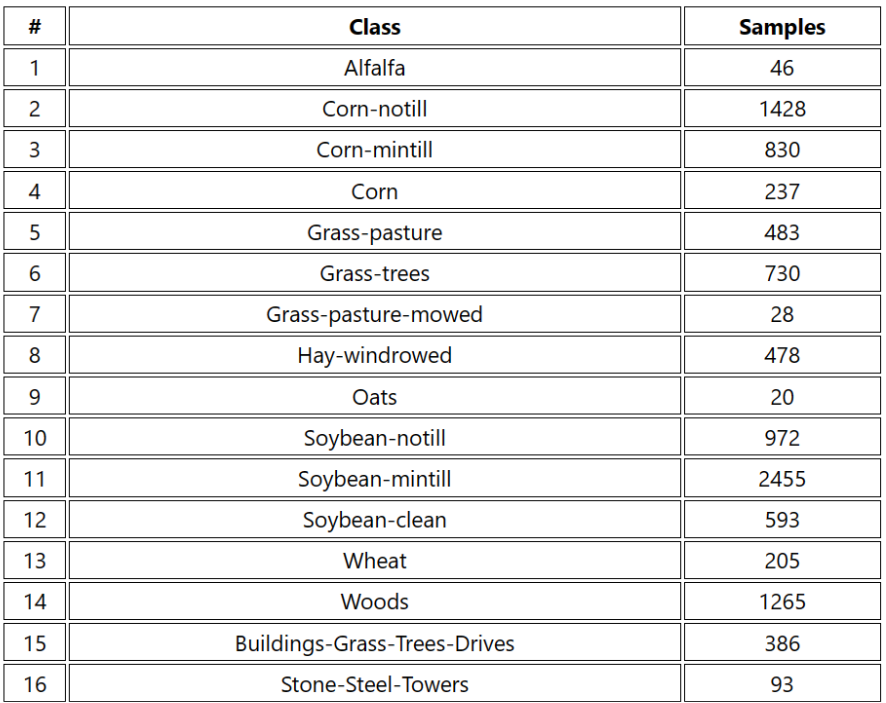
   Figure 1: Actual Classes for Indian Pines Scene

  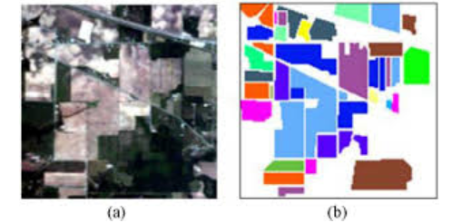
   Figure 2: Example Image from Indian Pines

## Data Transformations

In this section, we describe the various transformations applied to the data before feeding it into the 2D CNN model.

### Raw Data Results

  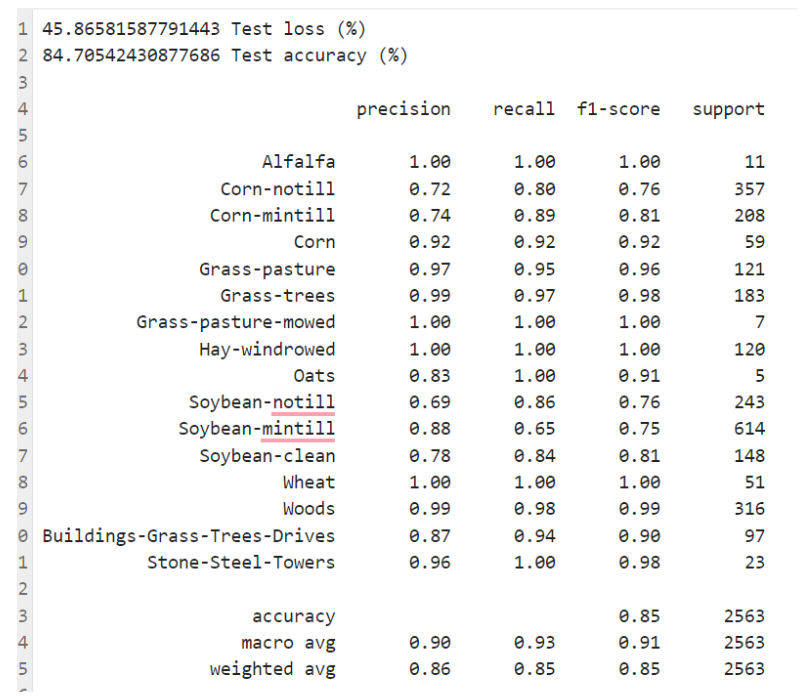
   Figure 3: Raw Data Results

**Training Results:**
- **Accuracy:** 0.9684
- **Loss:** 0.1064

The raw data results show a noticeable difference between the training accuracy (0.968) and the test accuracy (84.7%). This disparity suggests overfitting, where the model performs well on the training data but generalizes poorly to new data. This observation highlights the need for exploring data preprocessing techniques to improve model generalization.

### PCA Application

We applied Principal Component Analysis (PCA) for several reasons:

- **Dimensionality Reduction**: Hyperspectral data often have high dimensionality with numerous variables, making model training more complex and computationally intensive. PCA helps reduce dimensionality by projecting variables into a lower-dimensional space while retaining essential information.

- **Improved Generalization**: PCA can help simplify models, reducing overfitting and improving the model's ability to generalize to new data. This helps in avoiding poor performance on test sets.

- **Elimination of Correlation**: PCA can reduce correlation between variables, which benefits some machine learning algorithms. By reducing redundancy, models can become more robust and less sensitive to data variations.

  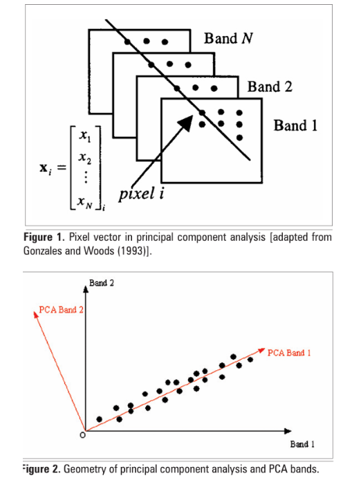
   Figure 4: PCA Explanation Diagram

**PCA Component Selection:**

We empirically determined the optimal number of PCA components by:

1. **Calculating Explained Variance Ratio**: Measuring the proportion of total variance explained by each principal component.
2. **Calculating Cumulative Explained Variance Ratio**: Summing the explained variance ratios to see how much total variance is captured as additional components are added.
3. **Determining the Number of Components**: Selecting the number of components where the cumulative explained variance reaches or exceeds a specified threshold (99%).

  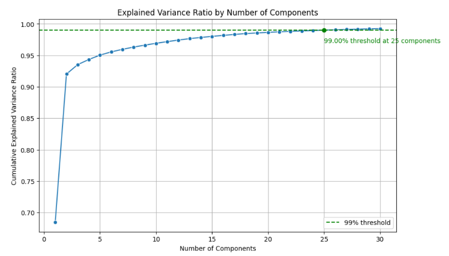
   Figure 5: Cumulative Variance Ratio vs. Number of Components

**Results After PCA:**

  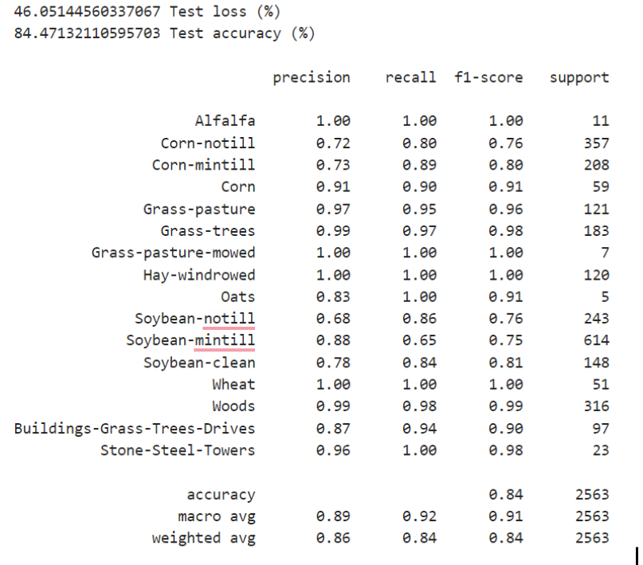
   Figure 6: Results After PCA

**Training Accuracy:** 0.7294

Applying PCA led to a reduction in training accuracy from 0.968 to 0.729, though test accuracy remained relatively stable (84.47%). This indicates that PCA reduced the dimensionality of the data, preserving significant components while leading to some loss of information in training data.

### Class Rebalancing

  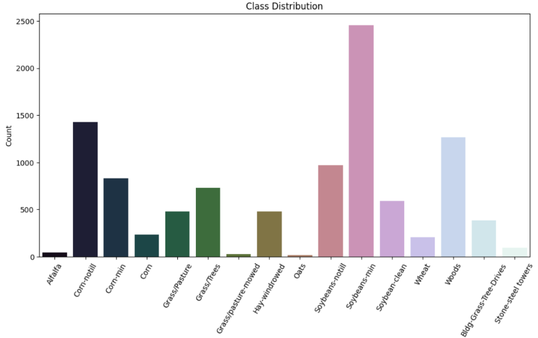
   Figure 7: Class Distribution

To address class imbalance, we performed class oversampling by duplicating samples from minority classes to balance them with majority classes. This approach ensures that the model does not favor majority classes.

**Results After Class Oversampling:**

  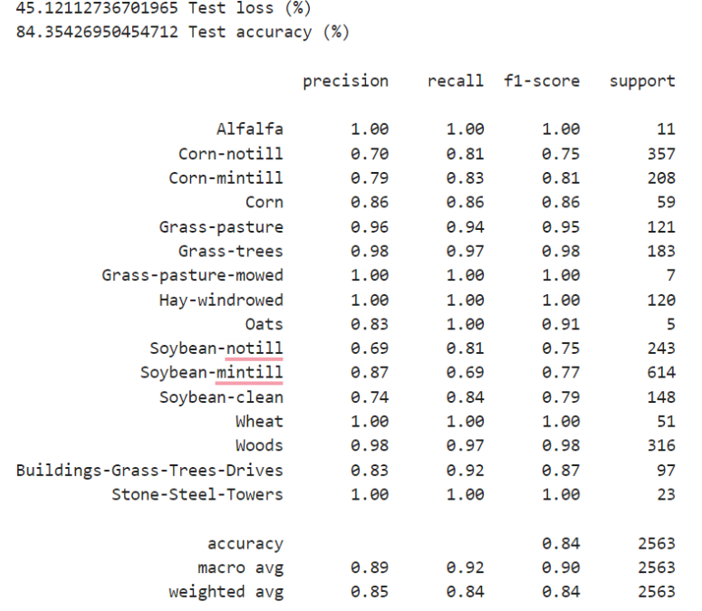
   Figure 8: Results After Class Oversampling

**Training Accuracy:** 0.9433

Oversampling improved scores for initially weak classes. However, overall model accuracy did not significantly change, highlighting the need to monitor model performance on both individual classes and the entire dataset.

### Data Augmentation

We applied data augmentation to enrich the training set by introducing variations in the images. Techniques used include vertical flipping, horizontal flipping, and random rotation.

**Results After Data Augmentation:**

  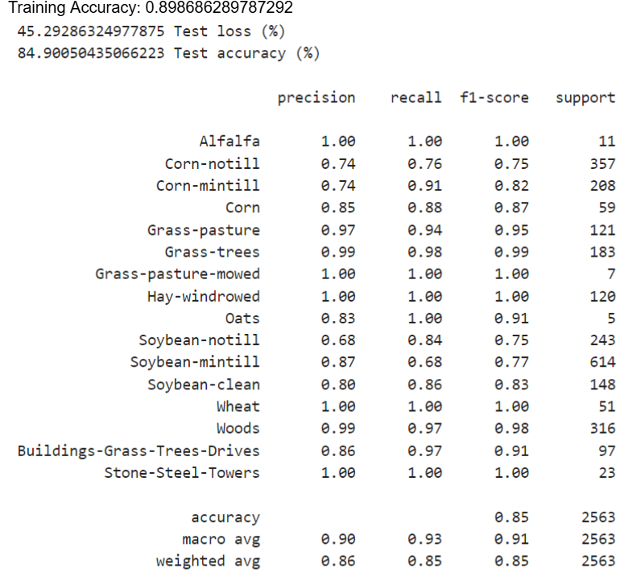
   Figure 9: Results After Data Augmentation

**Training Accuracy:** 0.8987

Data augmentation slightly decreased training accuracy but significantly improved test performance, indicating better generalization and model reliability.

## Model Comparison

### 2D CNN Model

  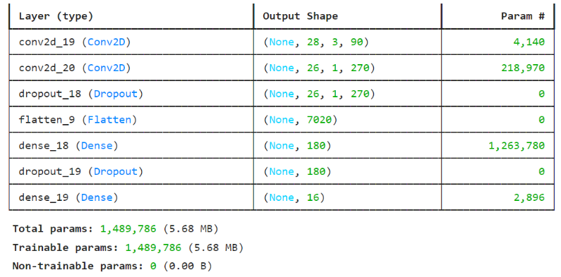
   Figure 10: 2D CNN Model Architecture

**Architecture Description:**

- **Conv2D Layer**: Convolves the input image with 32 filters of size (3, 3).
- **Conv2D Layer**: Applies 64 filters of size (3, 3) to the previous layer's output.
- **Dropout Layer**: Randomly deactivates 25% of neurons to prevent overfitting.
- **Flatten Layer**: Converts 2D feature maps into a 1D vector for fully connected layers.
- **Dense Layer**: Combines features to learn abstract representations.
- **Dropout Layer**: Randomly deactivates 50% of neurons to reduce overfitting.
- **Dense Layer**: Final layer with 16 neurons and 'softmax' activation for class predictions.

**Training Accuracy:** 0.9963

  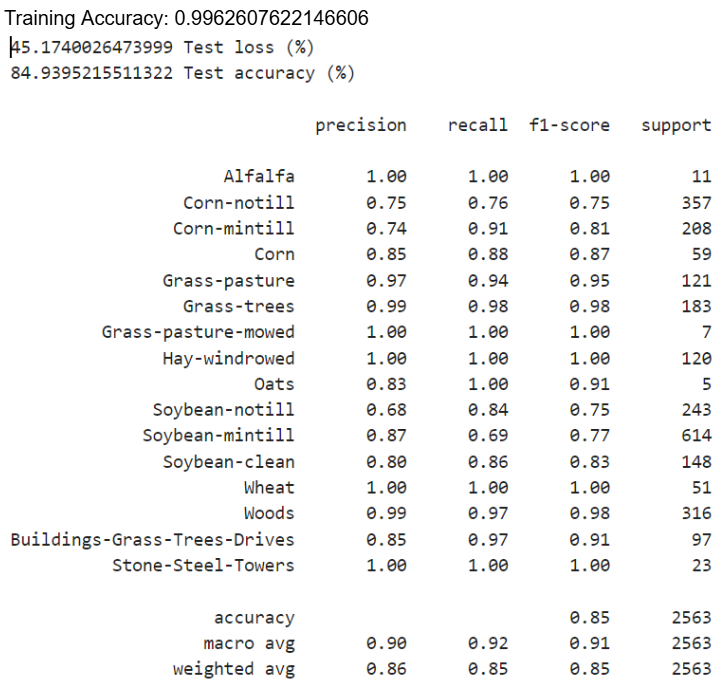
   Figure 11: 2D CNN Model Results

**Parameter Adjustments:**

- **Number of Epochs**: Increasing epochs significantly improved accuracy.

  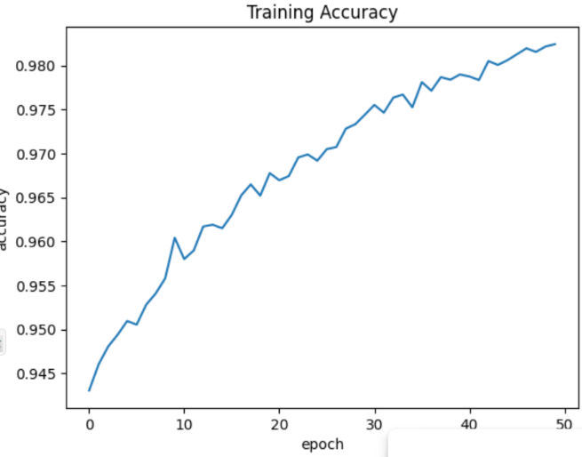
   Figure 12: Accuracy vs. Number of Epochs

- **Convolution Window Size**: Changing the kernel size from (3, 3) to (5, 5) improved accuracy.

  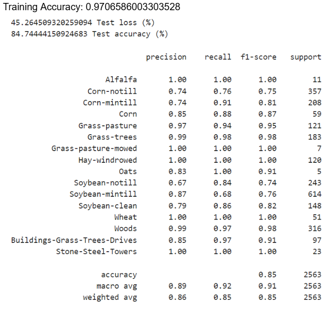
   Figure 13: Results After Increasing Kernel Size

### 3D CNN Model

  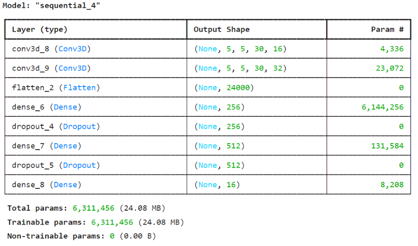
   Figure 14: 3D CNN Model Architecture

**Architecture Description:**

- **Conv3D Layer**: Convolves the input volume with 16 filters of size (3, 3, 30).
- **Conv3D Layer**: Applies 32 filters of size (3, 3, 5) to the previous layer's output.
- **Flatten Layer**: Converts 3D volume into a 1D vector for fully connected layers.
- **Dense Layers**: Two fully connected layers with 256 and 512 neurons, respectively, and 'relu' activation.
- **Dropout Layers**: Added to prevent overfitting.
- **Dense Layer**: Final layer with 16 neurons and 'softmax' activation for class predictions.

**Results:**

- **Training Loss:** 0.0063
- **Training Accuracy:** 0.9995

  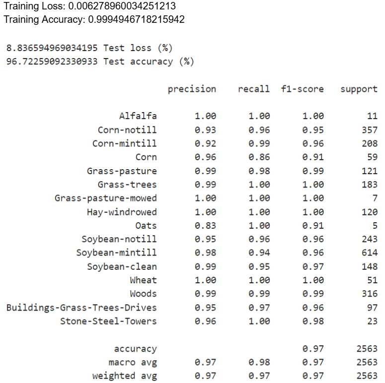
   Figure 15: 3D CNN Model Results

**Performance Insights:**

The 3D CNN model outperforms the 2D CNN model due to its ability to leverage spectral information and model complex spatial-spectral relationships. Increasing the convolution window size from 5 to 15 further enhanced performance.

  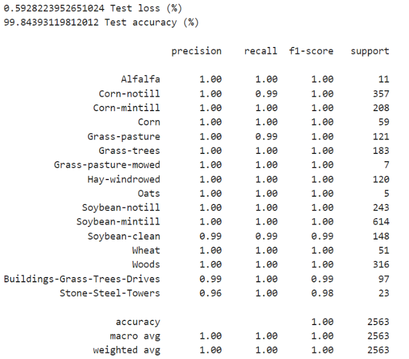
   Figure 16: Results After Increasing Window Size

### FCNN Model

  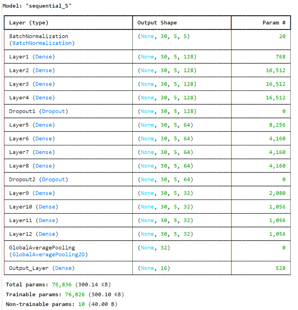
   Figure 17: FCNN Model Architecture

**Results:**

- **Testing Accuracy:** 0.57
- **Training Accuracy:** 0.63

The FCNN model did not perform well, possibly due to improper input configuration. FCNNs replace fully connected layers with convolutional layers, preserving spatial structure but may require careful tuning.

## Conclusion

In summary, the 3D CNN model proved most effective for hyperspectral image processing, outperforming both the 2D CNN and FCNN models due to its ability to handle spectral and spatial data more comprehensively. Parameter tuning and model adjustments, including increasing the convolution window size and employing advanced data augmentation techniques, led to significant improvements in accuracy and performance.
